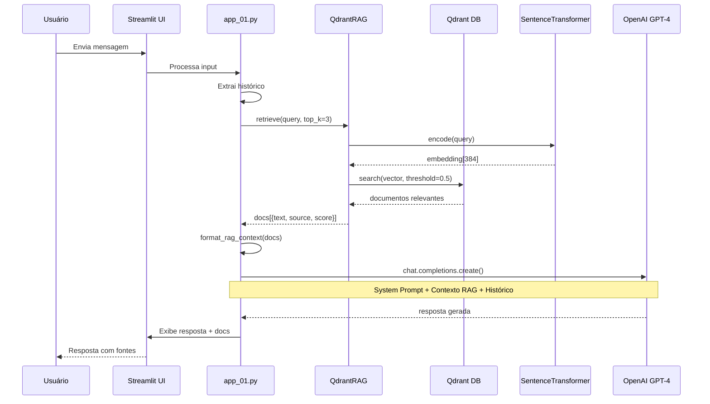

# 📚 RESUMO TÉCNICO DO PROJETO - VOXMAP

## 🎯 Visão Geral
**VOXMAP** é um assistente conversacional inteligente desenvolvido com **Streamlit** que combina análise de sentimentos, visualizações de dados e busca semântica com RAG (Retrieval Augmented Generation) para atendimento e conciliação de clientes.

---

## 🏗️ Arquitetura do Sistema

### **1. Interface & Aplicação Principal**
- **Framework**: Streamlit 1.50.0
- **Arquivo principal**: [app_01.py](app_01.py)
- **Funcionalidades**:
  - Chat interativo com histórico persistente
  - Painel de controle lateral com métricas em tempo real
  - Análise multi-dimensional de conversas

### **2. Módulo RAG (Sistema de Busca Semântica)**

**Arquitetura RAG Implementada:**

```
┌─────────────────────────────────────────────────────────┐
│              VOXMAP - Arquitetura RAG                   │
└─────────────────────────────────────────────────────────┘

┌─────────────────┐
│ Usuário envia   │
│ mensagem        │
└────────┬────────┘
         │
         v
┌────────────────────────────────────────────────┐
│  1. PROCESSAMENTO DA QUERY                     │
│  • Extrai últimas mensagens do histórico       │
│  • Combina contexto conversacional             │
└────────┬───────────────────────────────────────┘
         │
         v
┌────────────────────────────────────────────────┐
│  2. GERAÇÃO DE EMBEDDINGS                      │
│  • Modelo: paraphrase-multilingual-MiniLM-L12  │
│  • Dimensão: 384                               │
│  • Suporta PT-BR nativamente                   │
└────────┬───────────────────────────────────────┘
         │
         v
┌────────────────────────────────────────────────┐
│  3. BUSCA VETORIAL (Qdrant)                    │
│  • Similaridade: COSINE                        │
│  • Top-K configurável (padrão: 3)              │
│  • Score threshold: 0.5                        │
│  • Filtros por categoria (opcional)            │
└────────┬───────────────────────────────────────┘
         │
         v
┌────────────────────────────────────────────────┐
│  4. FORMATAÇÃO DO CONTEXTO                     │
│  • Documentos recuperados                      │
│  • Metadados: fonte, categoria, relevância     │
│  • Injeção no System Prompt                    │
└────────┬───────────────────────────────────────┘
         │
         v
┌────────────────────────────────────────────────┐
│  5. GERAÇÃO DA RESPOSTA (OpenAI)               │
│  • System Prompt + Contexto RAG                │
│  • Histórico conversacional                    │
│  • Resposta fundamentada em documentos         │
└────────┬───────────────────────────────────────┘
         │
         v
┌────────────────────────────────────────────────┐
│  6. EXIBIÇÃO NA UI                             │
│  • Resposta do assistente                      │
│  • Documentos consultados (expandível)         │
│  • Scores de relevância                        │
└────────────────────────────────────────────────┘
```

**Componentes do RAG:**

**Base de Conhecimento:**
- **Localização**: `./rag/base_conhecimento/`
- **Formatos suportados**: TXT, PDF
- **Estrutura**: Organização por categorias (pastas)
- **Chunking inteligente**:
  - TXT: Divisão semântica por separadores (`===`, `PROBLEMA:`, `---`)
  - PDF: Divisão por tamanho com overlap (500 palavras, 50 de sobreposição)

**Banco de Dados Vetorial:**
- **Sistema**: Qdrant (modo Docker - porta 6333)
- **Persistência**: Volume Docker
- **Coleção**: `voxmap_kb`
- **Distância**: COSINE similarity
- **Metadados armazenados**:
  - Texto do chunk
  - Fonte (nome do arquivo)
  - Categoria
  - Tipo de arquivo
  - Índice do chunk
  - Total de chunks

**Modelo de Embeddings:**
- **Nome**: `paraphrase-multilingual-MiniLM-L12-v2`
- **Dimensionalidade**: 384
- **Tipo**: Sentence Transformers
- **Idiomas**: Multilíngue (otimizado para PT-BR)
- **Tamanho**: ~120MB

**Módulos RAG:**
- [rag_module.py](rag/rag_module.py): Classe `QdrantRAG` com toda a lógica
- [rag_config.py](rag/rag_config.py): Configurações e casos de uso

---

## 📦 Principais Bibliotecas

### **Núcleo da Aplicação**
| Biblioteca | Versão | Função |
|------------|--------|--------|
| **streamlit** | 1.50.0 | Framework web interativo |
| **openai** | 2.6.1 | API para geração de respostas (GPT-4) |
| **python-dotenv** | 1.1.1 | Gerenciamento de variáveis de ambiente |

### **Sistema RAG (Busca Semântica)**
| Biblioteca | Versão | Função |
|------------|--------|--------|
| **qdrant-client** | 1.15.1 | Cliente para banco de dados vetorial |
| **sentence-transformers** | 5.1.2 | Geração de embeddings multilíngue |
| **PyPDF2** | 3.0.1 | Extração de texto de arquivos PDF |
| **torch** | 2.9.0 | Backend para modelos de ML |
| **transformers** | 4.57.1 | Modelos de linguagem (Hugging Face) |

### **Análise de Sentimentos**
| Biblioteca | Versão | Função |
|------------|--------|--------|
| **scikit-learn** | 1.7.2 | Algoritmos de ML |
| **numpy** | 2.3.4 | Computação numérica |
| **pandas** | 2.3.3 | Manipulação de dados |

### **Visualizações**
| Biblioteca | Versão | Função |
|------------|--------|--------|
| **wordcloud** | 1.9.4 | Nuvem de palavras |
| **networkx** | 3.5 | Grafos de coocorrência |
| **pyvis** | 0.3.2 | Visualização interativa de grafos |
| **matplotlib** | 3.10.7 | Gráficos e visualizações |
| **pillow** | 11.3.0 | Processamento de imagens |

### **Infraestrutura**
| Biblioteca | Versão | Função |
|------------|--------|--------|
| **docker** | 7.1.0 | API Docker para containers |
| **requests** | 2.32.5 | Cliente HTTP |
| **PyYAML** | 6.0.3 | Parsing de arquivos YAML |

---

## 🧠 Funcionalidades Principais

### **1. Sistema de Chat Inteligente**
- Assistente baseado em GPT-4.1-mini
- Prompt de sistema especializado em atendimento e conciliação
- Histórico conversacional persistente
- Integração automática com base de conhecimento (RAG)

### **2. Análise de Sentimentos em Tempo Real**
- Classificação: Positivo, Neutro, Negativo
- Confiança do modelo (0-100%)
- Identificação de emoções
- Evolução temporal com gráfico de linha
- Score normalizado (-1 a +1)

### **3. Visualizações Avançadas**

**Nuvem de Palavras:**
- Tokenização PT-BR com stopwords
- Atualização incremental por mensagem
- Exportação em PNG
- Filtro de palavras irrelevantes

**Grafo de Palavras:**
- Coocorrências por bigram
- Visualização interativa (PyVis)
- Dimensionamento por frequência
- Filtros:
  - Peso mínimo de arestas
  - Profundidade de caminhos
  - Palavra-alvo destacada
- Modo escuro/claro

### **4. Sistema RAG (Busca na Base de Conhecimento)**
- Busca semântica automática
- Filtros por caso de uso:
  - Suporte Técnico TI
  - Relacionamento com Cliente
  - Atendimento Geral
- Configurações ajustáveis:
  - Número de documentos (top-k)
  - Relevância mínima (threshold)
- Exibição de contexto usado
- Recarregamento dinâmico da base
- Estatísticas em tempo real

---

## 🔧 Casos de Uso do RAG

### **1. Suporte Técnico TI**
- Categoria: `suporte_tecnico`
- Documenta problemas técnicos, soluções e procedimentos
- Prompt adicional foca em precisão técnica

### **2. Relacionamento com Cliente**
- Categoria: `relacionamento`
- Políticas, scripts de atendimento, FAQs
- Prompt adicional foca em empatia e políticas

### **3. Atendimento Geral**
- Sem filtro de categoria
- Busca em toda a base de conhecimento
- Ideal para contextos mistos

---

## 🐳 Deploy & Infraestrutura

### **Docker Compose**
```yaml
services:
  qdrant:
    image: qdrant/qdrant:latest
    ports: 6333:6333
    volumes: ./qdrant_storage:/qdrant/storage

  app:
    build: .
    ports: 8501:8501
    environment:
      - OPENAI_API_KEY=${OPENAI_API_KEY}
```

### **Ambiente de Desenvolvimento**
- Python 3.12
- Virtualenv (.venv)
- Variáveis em `.env`
- Streamlit com hot-reload

---

## 📊 Performance & Otimização

- **Cache de RAG**: `@st.cache_resource` para instância única
- **Batch upsert**: Inserção de vetores em lotes de 100
- **Lazy loading**: Bibliotecas opcionais carregadas sob demanda
- **Persistência**: Qdrant mantém índice em disco
- **Modelo leve**: MiniLM (384d) balanceia velocidade e precisão

---

## 🔒 Segurança

- API keys em variáveis de ambiente
- `.gitignore` para arquivos sensíveis
- Validação de entradas
- Tratamento de exceções robusto
- Logs opcionais (modo verbose)

---

## 📈 Métricas Disponíveis

- Total de documentos na base
- Documentos por categoria
- Mensagens analisadas
- Evolução do sentimento
- Scores de relevância RAG
- Estatísticas do grafo de palavras

---

## 🚀 Como Executar

### **1. Instalar dependências:**
```bash
pip install -r requirements.txt
```

### **2. Configurar variáveis (.env):**
```env
OPENAI_API_KEY=sua_key_aqui
OPENAI_MODEL=gpt-4.1-mini
```

### **3. Iniciar Qdrant (Docker):**
```bash
docker compose up -d qdrant
```

### **4. Rodar aplicação:**
```bash
streamlit run app_01.py
```

---

## 🔄 Fluxo Completo do Sistema RAG



---

## 📁 Estrutura do Projeto

```
Primeiro_Trabalho/
├── app_01.py                    # Aplicação principal Streamlit
├── app_02.py                    # Versão alternativa
├── .env                         # Variáveis de ambiente (não commitado)
├── .gitignore                   # Arquivos ignorados pelo Git
├── Dockerfile                   # Imagem Docker
├── docker-compose.yml           # Orquestração de containers
├── README.md                    # Documentação geral
├── Arquitetura_RAG.md          # Este arquivo
│
├── rag/                        # Módulo RAG
│   ├── __init__.py
│   ├── rag_module.py           # Classe QdrantRAG
│   ├── rag_config.py           # Configurações
│   ├── base_conhecimento/      # Documentos TXT/PDF
│   │   ├── suporte_tecnico/
│   │   └── relacionamento/
│   └── utils/
│       ├── check_rag_setup.py
│       ├── generate_pdfs.py
│       └── visualizar_qdrant.py
│
├── Deploy/                     # Arquivos de deploy
├── Prompts/                    # Prompts de sistema
└── source/                     # Arquivos fonte
```

---

## 🧪 Testes e Validação

### **Verificar setup RAG:**
```bash
python rag/utils/check_rag_setup.py
```

### **Visualizar conteúdo Qdrant:**
```bash
python rag/utils/visualizar_qdrant.py
```

### **Gerar PDFs de teste:**
```bash
python rag/utils/generate_pdfs.py
```

---

## 🎓 Conceitos Técnicos

### **O que é RAG?**
Retrieval Augmented Generation é uma técnica que combina:
1. **Retrieval**: Busca de documentos relevantes em uma base de conhecimento
2. **Augmentation**: Enriquecimento do contexto com informações recuperadas
3. **Generation**: Geração de respostas baseadas no contexto ampliado

**Vantagens:**
- Respostas fundamentadas em dados reais
- Reduz alucinações do modelo
- Permite atualização da base sem retreinar
- Rastreabilidade (cita fontes)

### **Embeddings Vetoriais**
Transformação de texto em vetores numéricos que capturam significado semântico:
- Textos similares têm vetores próximos
- Permite busca por similaridade matemática (cosine)
- Independente de palavras-chave exatas

### **Chunking Semântico**
Divisão inteligente de documentos em pedaços menores:
- Preserva contexto dentro de cada chunk
- Melhora precisão da busca
- Balanceia tamanho e relevância

---

## 📚 Referências e Recursos

- **Qdrant**: https://qdrant.tech/
- **Sentence Transformers**: https://www.sbert.net/
- **Streamlit**: https://streamlit.io/
- **OpenAI API**: https://platform.openai.com/docs/

---

## 👨‍💻 Autor
**Marcus Loreto**

---

## 📝 Changelog

### v1.0 (Atual)
- ✅ Sistema RAG completo com Qdrant
- ✅ Suporte a TXT e PDF
- ✅ Chunking semântico inteligente
- ✅ Múltiplos casos de uso
- ✅ Interface Streamlit otimizada
- ✅ Cache e performance melhorados
- ✅ Análise de sentimentos
- ✅ Visualizações interativas

---

## 🔮 Roadmap Futuro

- [ ] Suporte a mais formatos (DOCX, HTML)
- [ ] Fine-tuning do modelo de embeddings
- [ ] Sistema de feedback do usuário
- [ ] A/B testing de configurações RAG
- [ ] Métricas de qualidade das respostas
- [ ] API REST para integração externa
- [ ] Multitenancy (múltiplas bases)
- [ ] Versionamento de documentos

---

**Última atualização**: 27/10/2025
